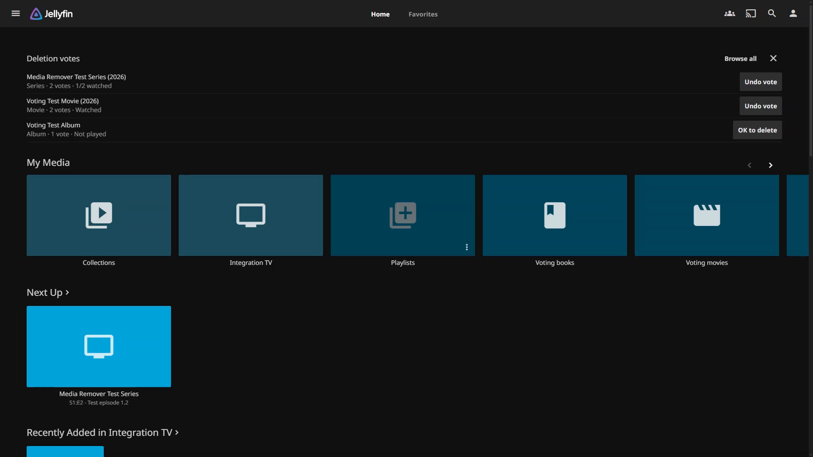
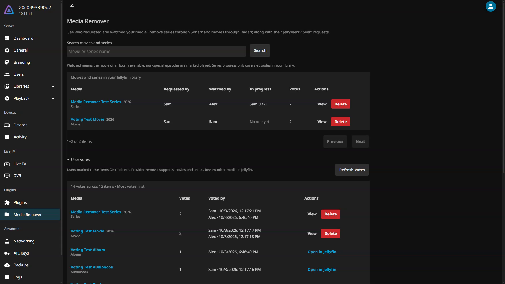
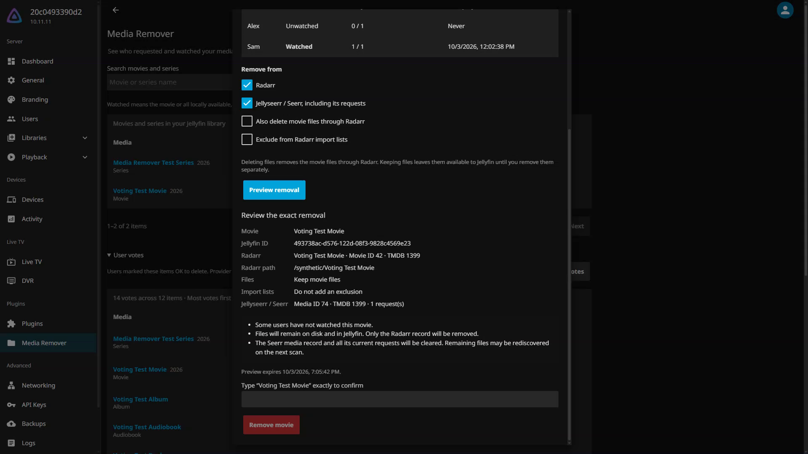

# 🚨 THIS REPO IS SLOP I HAVE NO INTEREST IN ADDING FEATURES IT NOT NECESSARY *FOR ME* 🚨

# Jellyfin Media Remover

**Let your users help decide what can go. Keep the final decision with the admin.**

A Jellyfin plugin that brings deletion votes, viewing progress, request owners, and provider cleanup into Jellyfin. Users mark media **OK to delete**. Admins review who requested it, who watched it, and which services will be affected before removing anything.

[Download v1.3.0](https://github.com/RealDoc06/jellyfin-media-remover/releases/tag/v1.3.0) · [Install](#install) · [How it works](#how-it-works) · [Edit and build](#edit-and-build) · [Screenshots](docs/screenshots.md)



## What it does

- **Voting that fits Jellyfin.** A dismissible poster row on Home, a searchable poster grid in the sidebar view, and an action in native media menus.
- **Useful context for admins.** Request owners, each user's viewing progress, vote totals, voter names, and dates.
- **Connected removal.** Movies through **Radarr + Jellyseerr / Seerr**; series through **Sonarr + Jellyseerr / Seerr**.
- **A deliberate last step.** Review exact provider matches, choose whether to delete files, and type the title to confirm. Resume incomplete operations from removal history.

**Votes never delete media or change watched state.** There are no scheduled or automatic deletions.

| Media | Advisory voting | Provider removal |
| --- | --- | --- |
| Movies | Yes | Radarr and/or Seerr |
| Series | Yes | Sonarr and/or Seerr |
| Episodes and seasons | Vote for the **whole series** | Whole-series removal |
| Videos, music videos, tracks, albums, audiobooks, books, photos, photo albums, collections, playlists | Yes | Review in Jellyfin; no provider removal in this release |

The injected voting interface works in **Jellyfin Web served by your Jellyfin server**. Native TV/mobile apps and separately hosted Jellyfin Web clients do not display it. The dashboard follows Jellyfin's existing theme.

## Install

### 1. Download the matching build

Check your server's version in the Jellyfin dashboard, then download its ZIP and `.sha256` file from the [release page](https://github.com/RealDoc06/jellyfin-media-remover/releases/tag/v1.3.0).

| Jellyfin server | Release archive | Runtime target |
| --- | --- | --- |
| **10.11.11** | [`media-remover-1.3.0-jellyfin-10.11.11.zip`](https://github.com/RealDoc06/jellyfin-media-remover/releases/download/v1.3.0/media-remover-1.3.0-jellyfin-10.11.11.zip) | .NET 9 |
| **12.1.0** | [`media-remover-1.3.0-jellyfin-12.1.0.zip`](https://github.com/RealDoc06/jellyfin-media-remover/releases/download/v1.3.0/media-remover-1.3.0-jellyfin-12.1.0.zip) | .NET 10 |

These two versions are tested separately. Do not mix their assemblies. Other Jellyfin versions have not been verified. You do not need a .NET SDK to install a release ZIP.

To verify a download on Linux, run this **in the folder containing both files**:

```sh
sha256sum -c media-remover-1.3.0-jellyfin-10.11.11.zip.sha256
```

On macOS, use `shasum -a 256 -c` instead of `sha256sum -c`. Substitute `12.1.0` for that build.

### 2. Install the plugin

1. Find **Plugins path** in your Jellyfin startup log. For Docker, map that container path to its persistent host volume. The location depends on how your server was configured.
2. Stop Jellyfin. Back up the previous plugin folder and [plugin data](#upgrading-and-backups) if upgrading.
3. Create `MediaRemover_1.3.0.0` inside the plugins directory and extract the ZIP into it. Move any older Media Remover plugin folder **outside** the plugins directory.
4. Ensure Jellyfin's operating-system user can read the files, then start Jellyfin.
5. Open **Dashboard → Plugins → Media Remover** as an administrator. Refresh already-open Jellyfin Web tabs to load the new voting controls.

The result should look like this, with no extra nested folder:

```text
<plugins directory>/
└── MediaRemover_1.3.0.0/
    ├── Jellyfin.Plugin.MediaRemover.dll
    ├── meta.json
    └── LICENSE
```

Installation is manual. This release does not provide a plugin-catalog repository URL or automatic updater.

### 3. Connect your providers

Expand **Provider connections**, enter the base URL and API key for each service you use, then **Save connections** and **Test saved connections**. Voting works independently of provider connections.

| Service | Used for | Example URL on a shared Docker network |
| --- | --- | --- |
| Sonarr | Series management and optional file deletion | `http://sonarr:8989` |
| Radarr | Movie management and optional file deletion | `http://radarr:7878` |
| Jellyseerr / Seerr | Request owners and request/media cleanup | `http://seerr:5055` |

URLs must be reachable **from the Jellyfin server**, including any configured reverse-proxy base path. In Docker, `localhost` refers to the Jellyfin container itself. Provider keys stay server-side; a blank key field keeps the saved key, and the dedicated checkbox clears it.

## How it works

### Users nominate media

Open an item's **More** menu and choose its deletion-vote action, or open **Deletion votes** in the sidebar to search your accessible library. **OK to delete** adds your vote; **Undo vote** on Home or **Withdraw vote** in the browser removes it. Episode and season actions always nominate their parent series.

Home shows up to **ten items nominated by other users**, ranked by vote count. Items with no votes or only your own vote do not appear there. Close the section to dismiss it for your account across devices; **Show on Home** in the voting browser restores it.

Regular users see their own progress and anonymous vote totals. Jellyfin's library, parental, and private-playlist restrictions still apply.

### Admins review the context

Open **Media Remover** in the dashboard to search movies and series. **View** shows request owners and each user's progress. Expand **User votes** to review all nominated media, including voter names and dates. Other media types link to their native Jellyfin pages.



For movies, “watched” means the movie is marked played in Jellyfin. For series, it means every currently indexed regular episode is marked played. Specials and virtual episodes are excluded; missing or unaired episodes cannot be inferred. Seerr requesters are linked by their exact Jellyfin user ID, never by a similar name.

### Admins confirm removal

1. Select **Delete** to prepare a preview, or choose providers in **View** and click **Preview removal**.
2. Review the provider records, IDs, and file path. **Delete files is off by default.**
3. Type the exact media title and confirm. Changing options requires a new preview.



Matching uses external IDs: TMDB for Radarr movies, TVDB for Sonarr series, and TMDB plus media type for Seerr. Names are never used to guess a provider record. A missing or conflicting identity stops removal.

Radarr or Sonarr runs first; Seerr cleanup follows after that step succeeds. If a later step fails, **Removal history** preserves the result and offers a retry that skips completed steps. Seerr cleanup removes the media record and its requests. File deletion is performed by Radarr/Sonarr, and Jellyfin picks up changes through monitoring or a library scan.

[Full behavior, progress definitions, and recovery details →](docs/how-it-works.md)

## Edit and build

### Prerequisites

- Git and the **.NET 10 SDK** to build both targets.
- The **ASP.NET Core 9 runtime** or **.NET 9 SDK** to run tests targeting Jellyfin 10.11.11.
- **Python 3** to create release ZIPs. No Python packages are required.
- **Node.js** for JavaScript syntax checks. There is no npm install step or web bundler.

```sh
git clone https://github.com/RealDoc06/jellyfin-media-remover.git
cd jellyfin-media-remover

# Build an installable ZIP for your Jellyfin version.
python3 scripts/package.py --jellyfin 10.11.11
# Or:
python3 scripts/package.py --jellyfin 12.1.0
```

The script builds Release output and writes the matching ZIP and SHA-256 file to `artifacts/`. Install the ZIP using the steps above. Set `DOTNET_BIN` if your `dotnet` executable is outside `PATH`.

### Where to make changes

All plugin code lives in `src/Jellyfin.Plugin.MediaRemover/`:

| Change | Files or directory |
| --- | --- |
| Home, sidebar, and native-menu voting UI | `Web/voting.js`, `Web/voting.css` |
| Admin dashboard and removal dialog | `Web/configuration.html`, `Web/configuration.js` |
| Voting rules, visibility, and persistence | `Voting/` |
| Authenticated API routes | `Api/` |
| Provider HTTP integrations | `Providers/` |
| Removal workflow, history, and progress | `Core/`, `JellyfinSeriesLibrary.cs` |
| Loading voting controls into Jellyfin Web | `WebIntegration/` |

HTML, JavaScript, and CSS are embedded in the DLL. After editing them, **rebuild, stop the test server, replace the plugin, restart, and refresh the browser**. Use a new plugin version when distributing changes so versioned web assets refresh correctly.

```sh
dotnet test --configuration Release
dotnet test --configuration Release -p:JellyfinVersion=12.1.0
node --check src/Jellyfin.Plugin.MediaRemover/Web/configuration.js
node --check src/Jellyfin.Plugin.MediaRemover/Web/voting.js
```

Run different-target builds and tests sequentially because they share intermediate output. Version 1.3.0 passed **274 unit tests and 74 integration checks per target**. Integration tests run real disposable Jellyfin servers with generated media and simulated providers.

[Development workflow →](docs/development.md) · [Run the integration environment →](docs/testing.md)

## Upgrading and backups

Keep a backup of the previous plugin, Jellyfin's plugin configuration XML, and these files under your **Jellyfin data directory**:

```text
media-remover/votes.json       # Votes and per-account Home preferences
media-remover/operations.json  # Removal history and resumable operations
```

Stop Jellyfin before replacing its plugin files. Keep only one Media Remover assembly installed, use the ZIP for the server version, then restart and refresh Jellyfin Web. Version 1.3.0 preserves existing series votes, timestamps, and Home preferences.

To roll back, stop Jellyfin and restore the previous plugin with its matching configuration and data backup. A plugin rollback cannot undo provider or file deletions. Treat configuration backups as sensitive because Jellyfin's plugin XML contains the provider API keys.

## Troubleshooting and limits

- **Plugin does not load:** check the server version, extracted folder layout, file permissions, and Jellyfin logs.
- **Voting controls are missing:** use server-hosted Jellyfin Web, refresh the browser, and check whether you dismissed Home. The sidebar can restore it.
- **Provider connection fails:** test the URL from Jellyfin's host/container; verify the API key and base path.
- **No matching provider record:** correct the media's TMDB/TVDB metadata. The plugin does not match by title.
- **Only some removal steps succeeded:** inspect Removal history, fix the provider connection, and retry as the same administrator.

Provider removal currently supports one instance each of Radarr, Sonarr, and Seerr. Music/book managers, direct torrent-client cleanup, season-only removal, and automatic deletion are not implemented. An affirmative vote is useful feedback, not proof that every user is finished with the media.

## License

The plugin's code is available under the [MIT license](LICENSE). Jellyfin and other dependencies retain their own licenses; Jellyfin's referenced assemblies are not included in the plugin ZIP.
