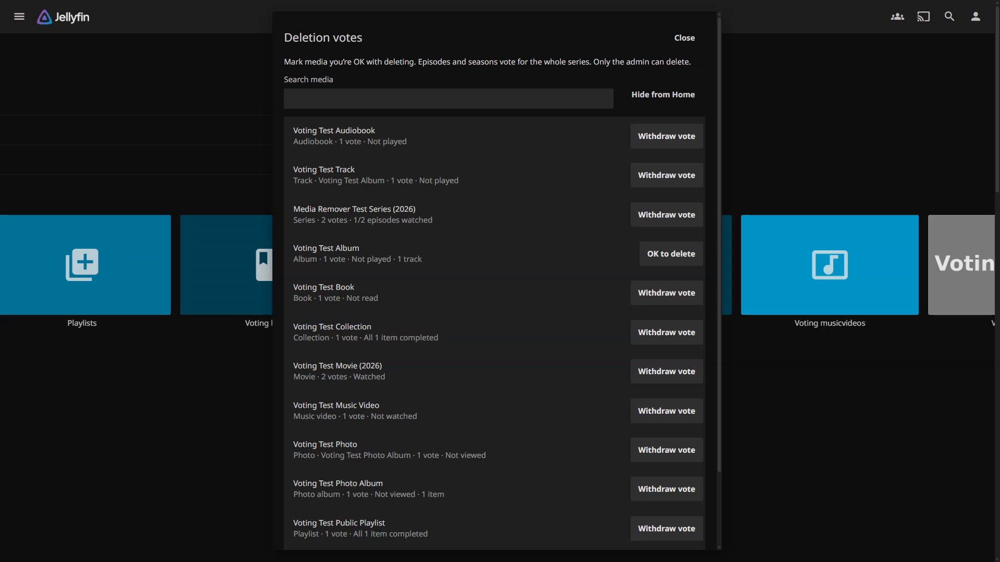
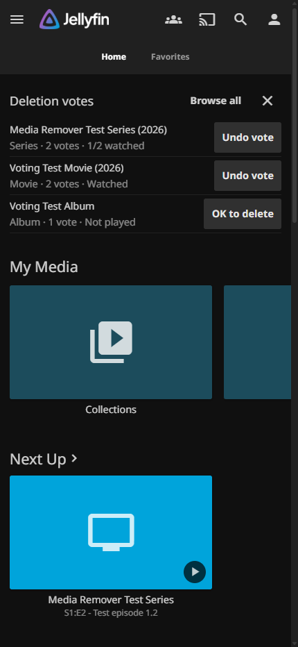

# Screenshot gallery

These are captures of the actual plugin in Jellyfin Web, using synthetic media, accounts, and provider records. Open an image to view its full resolution.

## Home voting

Up to ten items nominated by other users appear on Home as a row of posters. Vote or undo in one click, browse all media, or dismiss the section for your account.

## Searchable voting browser

The **Deletion votes** sidebar entry remains available when Home is dismissed. Search accessible media and restore the Home section here. Episodes and seasons vote for the whole series.

## Admin library

See who requested a movie or series, who finished it, and who is still watching. Review nominated media and the people who voted in **User votes**.

## Provider removal preview

Movies use Radarr and Seerr; series use Sonarr and Seerr. Review the matched records and file path, select whether to remove files, then type the exact title. Voting never triggers this operation.

## Mobile Jellyfin Web

The same Home controls adapt to a narrow screen. This is the browser interface; native Jellyfin mobile and TV apps do not include the injected voting controls.

[Back to the README](../README.md)
